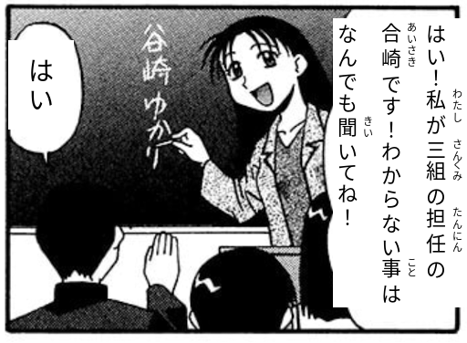

# Furikanji

Adds furigana to kanji in images.

**Input Image:**


**Output Image:**



## Setup

1. **Clone the repository:**
   ```bash
   git clone --recurse-submodules https://github.com/tiagopvianna/furikanji.git
   cd furikanji
   ```

2. **Install dependencies:**
   ```bash
   pip install -e .
   ```

3. **Choose dictionary mode (recommended):**
   - Small install (default quality, fastest setup):
   ```bash
   pip install -e ".[unidic-lite]"
   ```
   - Better reading quality (large one-time download, kept outside this repo):
   ```bash
   pip install -e ".[unidic]"
   python -m unidic download
   ```
   - Sudachi backend (alternative tokenizer + core dictionary):
   ```bash
   pip install -e ".[sudachi]"
   ```
   The UniDic download is stored in your Python environment/cache, not in this git repository.

## Usage

```bash
python -m src.furikanji.main ./example/full_page.jpg --output_path full_page_output.png --draw_target_boxes False --draw_overlay_text True --reading_backend sudachi
```

Reading backend:
- `sudachi` is the default and recommended backend.
- You can still select Fugashi explicitly when needed.

Fugashi example:
```bash
python -m src.furikanji.main <image_path> --reading_backend fugashi --output_path <output_path>
```

## Sudachi Reading Overrides

Sudachi overrides are defined in:

`src/furikanji/adapters/sudachi_reading_overrides.json`

Each rule can override a token reading with optional context constraints:

- `kanji`: token surface to match
- `reading`: replacement reading (hiragana recommended)
- `pos_contains`: optional substring match on Sudachi POS fields
- `next_surfaces`: optional allow-list for next token surface
- `prev_surfaces`: optional allow-list for previous token surface
- `exception_prefixes`: skip rule when left context ends with any value
- `exception_suffixes`: skip rule when right context starts with any value

Example:

```json
{
  "rules": [
    {
      "kanji": "私",
      "reading": "わたし",
      "pos_contains": ["代名詞"],
      "next_surfaces": [],
      "prev_surfaces": [],
      "exception_prefixes": [],
      "exception_suffixes": []
    }
  ]
}
```
