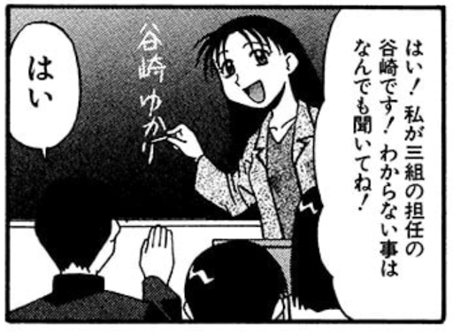
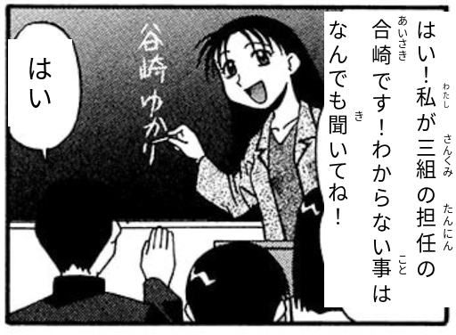
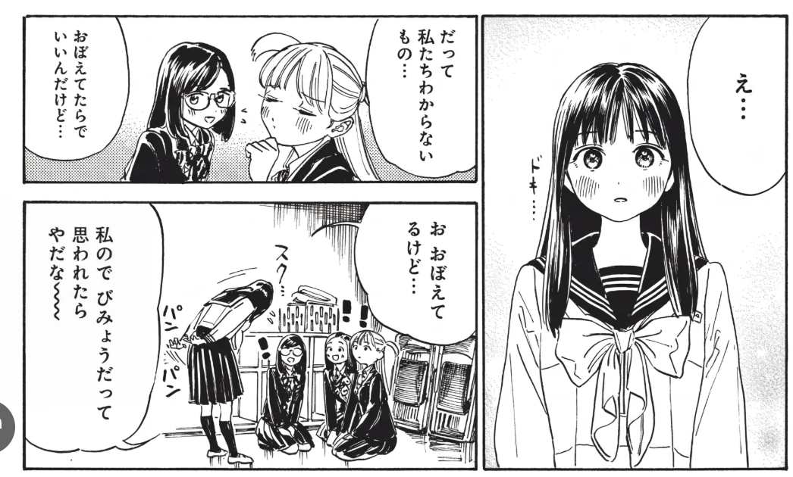
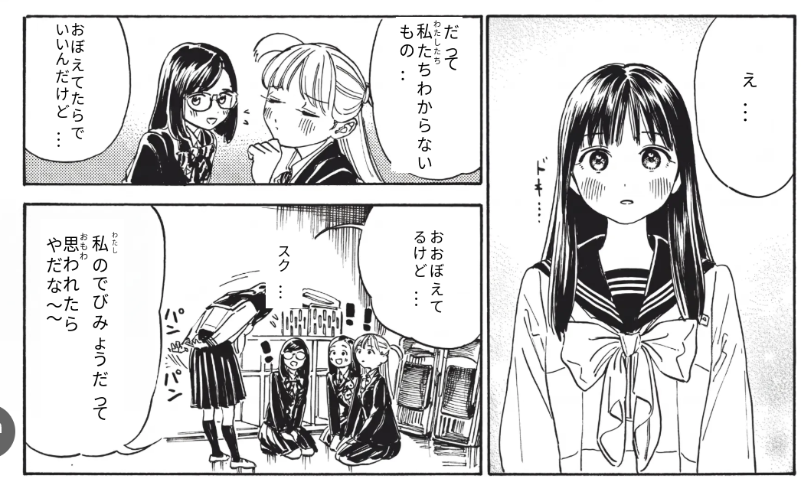
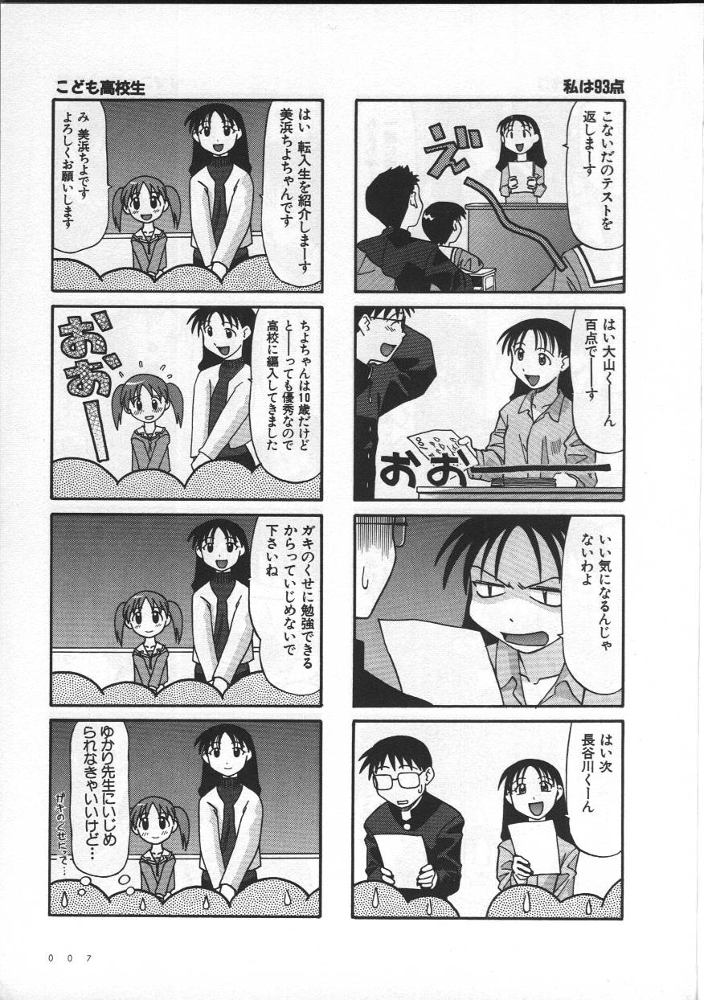
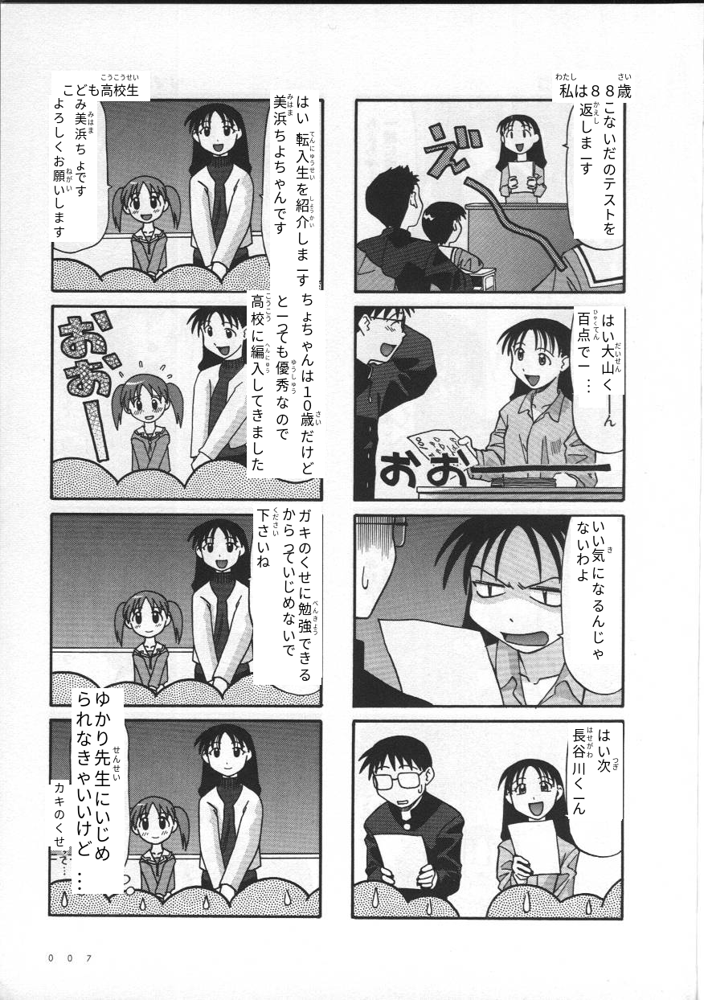

# Furikanji

Adds furigana to kanji in images.

## Examples

### Sample 1

| Input | Output |
|---|---|
|  |  |

### Sample 2

| Input | Output |
|---|---|
|  |  |

### Full page

| Input | Output |
|---|---|
|  |  |

## Setup

1. **Clone the repository:**
   ```bash
   git clone --recurse-submodules https://github.com/tiagopvianna/furikanji.git
   cd furikanji
   ```

2. **Install dependencies:**
   ```bash
   pip install -e .
   ```

## Usage

```bash
python -m src.furikanji.main ./example/full_page.jpg --output_path ./example/full_page_result.png --draw_target_boxes False --draw_overlay_text True
```

Reading backend:
- Sudachi is the only supported backend.

## Vertical Ruby Fit

Vertical rendering now constrains each furigana token to its own base-token span budget.

Relevant `FuriganaRenderConfig.vertical` options:
- `ruby_fit_policy`: currently `"shrink_then_skip"` (default)
- `ruby_min_size`: minimum per-token ruby font size during fit
- `ruby_min_spacing`: minimum per-token ruby spacing during fit
- `ruby_align`: `"top"` (default) or `"center"`

## Sudachi Reading Overrides

Sudachi overrides are defined in:

`src/furikanji/adapters/sudachi_reading_overrides.json`

Each rule can override a token reading with optional context constraints:

- `kanji`: token surface to match
- `reading`: replacement reading (hiragana recommended)
- `pos_contains`: optional substring match on Sudachi POS fields
- `next_surfaces`: optional allow-list for next token surface
- `prev_surfaces`: optional allow-list for previous token surface
- `exception_prefixes`: skip rule when left context ends with any value
- `exception_suffixes`: skip rule when right context starts with any value

Example:

```json
{
  "rules": [
    {
      "kanji": "私",
      "reading": "わたし",
      "pos_contains": ["代名詞"],
      "next_surfaces": [],
      "prev_surfaces": [],
      "exception_prefixes": [],
      "exception_suffixes": []
    }
  ]
}
```
